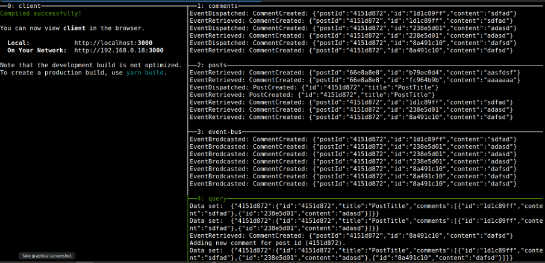

# mini-microservice-app
https://www.udemy.com/course/microservices-with-node-js-and-react


This projects showcases mini microservices. It aims to demonstrate the positive, and negatives of using event based communication services.

It consists of a client, posts service, comments service, and a query service. We demonstrate, that if both the posts and comments services were to crash, users would still be able to use a large portion of the app; namely getting the list of posts and comments from the query service; the only missing functionality would be to create the comments and posts. 

Last, but certainly not least, by using this query service, the client is quite faster, due to having to make a single query for all the posts and their comments. Leading to a better user experience. 

On the other hand, downside include data duplication, and maybe the greatest downside, a harder to understand design infrastructure for developers.



```
cd client && yarn start
cd comments && npm start
cd posts && npm start
cd event-bus && npm start
cd query && npm start
```
